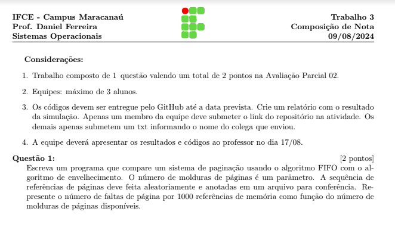
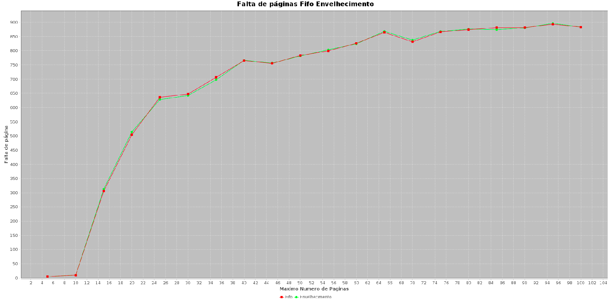
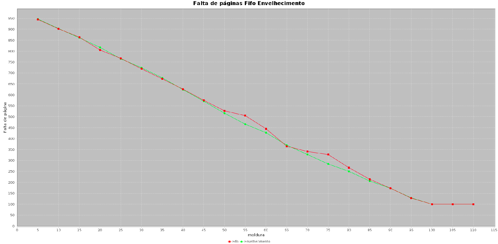

# Relatório de Simulação: Comparação entre FIFO e Envelhecimento

## 1. Introdução

Este relatório apresenta os resultados de uma simulação que compara dois algoritmos de paginação: **FIFO (First-In, First-Out)** e **Envelhecimento**. A simulação foi realizada variando tanto o número máximo de páginas quanto o número de molduras de páginas disponíveis, para observar o comportamento de faltas de página em cada cenário.

## 2. Metodologia

### 2.1. Geração de Sequência de Referência
- O programa gera uma sequência de referência de páginas aleatória de tamanho 1000.
- O valor de cada referência varia entre 0 e um valor constante.
- Uma sequência é gerada e salva em um arquivo para conferência posterior.

### 2.2. Algoritmos de Paginação
- **FIFO**: O algoritmo FIFO remove a página que foi carregada na moldura mais cedo.
- **Envelhecimento**: Este algoritmo atribui um valor de envelhecimento para cada página, atualizado a cada ciclo. A página com o menor valor de envelhecimento é removida quando necessário.

### 2.3. Simulação
- O número de faltas de página foi calculado para cada algoritmo, considerando diferentes tamanhos de molduras;
- Um gráfico foi gerado para visualizar o número de faltas de página por 1000 referências de memória, em função do número de molduras disponíveis.

## 3. Resultados

### 3.1. Variação do Número Máximo de Páginas
A primeira simulação variou o número máximo de páginas (5 a 100), mantendo o número de molduras fixo em 10. Os resultados foram os seguintes:

- **FIFO** apresentou um número de faltas de página maior do que o algoritmo de **Envelhecimento** em todos os cenários testados.
- À medida que o número máximo de páginas aumentou, o número de faltas de página também aumentou para ambos os algoritmos, como esperado, mas o crescimento foi mais acentuado para FIFO.

### 3.2. Variação do Número de Molduras
A segunda simulação variou o número de molduras disponíveis (5 a 110), mantendo o número máximo de páginas fixo em 50. Os resultados foram os seguintes:

- O número de faltas de página diminuiu à medida que o número de molduras aumentou, para ambos os algoritmos.
- O algoritmo **Envelhecimento** se mostrou mais eficiente, com uma queda mais rápida no número de faltas de página conforme o número de molduras aumentava.
- O algoritmo **FIFO** apresentou uma curva de declínio mais lenta, sugerindo menor eficiência em gerenciar o uso das molduras disponíveis.

## 4. Discussão

Os resultados mostram que o algoritmo de Envelhecimento é consistentemente mais eficiente que o FIFO, resultando em menos faltas de página tanto ao aumentar o número máximo de páginas quanto ao variar o número de molduras.

A razão para essa eficiência está no método de seleção de páginas a serem removidas:
- **FIFO** remove sempre a página mais antiga, sem considerar sua relevância ou frequência de uso recente.
- **Envelhecimento**, por outro lado, incorpora um sistema de contagem que considera o tempo e a frequência de uso, removendo as páginas que têm sido menos utilizadas de maneira inteligente.

## 5. Conclusão

A simulação evidencia que, para cenários em que a eficiência de memória é crucial, o algoritmo de **Envelhecimento** é superior ao **FIFO**. Portanto, para aplicações que exigem uma gestão mais eficiente da memória, recomenda-se a implementação de técnicas baseadas no envelhecimento, especialmente em ambientes com alto tráfego de páginas ou onde a disponibilidade de molduras é limitada.

---
